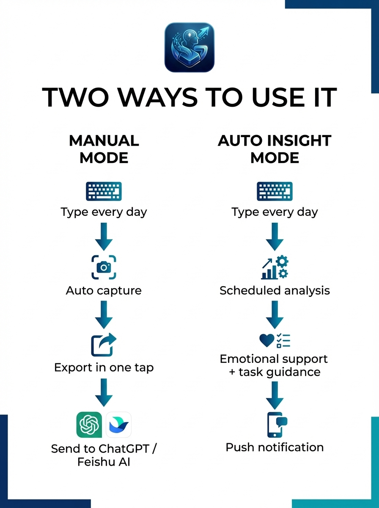
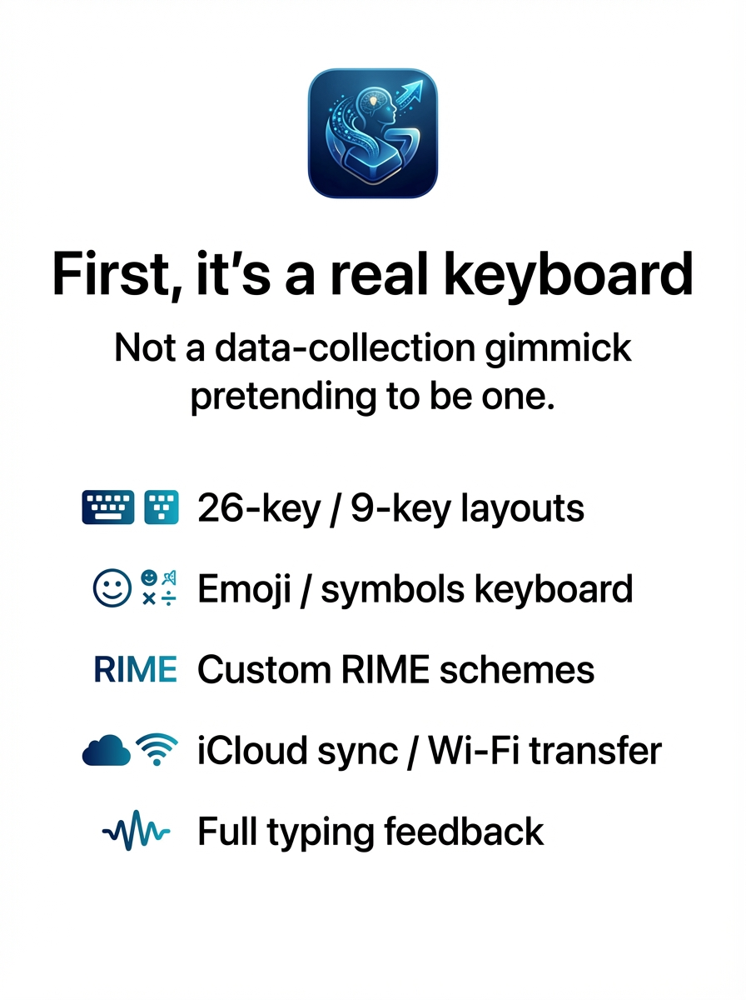
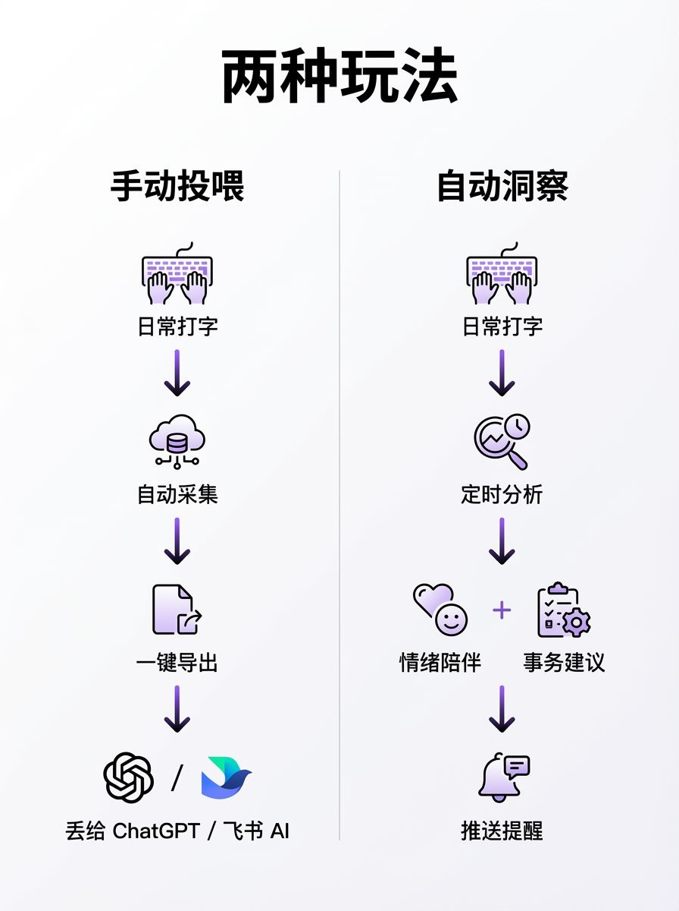
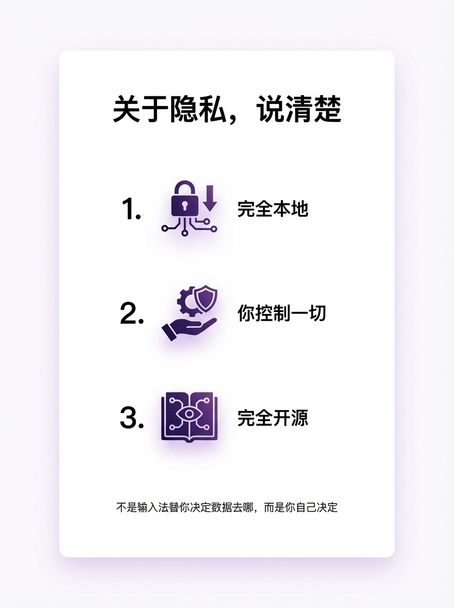

# GuruIM / 咕噜输入法

> **GuruIM captures all your input history — keystrokes, clipboard, and context — and lets you export it to any LLM, on your terms. Feed yourself to AI, willingly.**
>
> **GuruIM 采集你的全部输入记录——键盘上屏、剪贴板、上下文——在你的完全控制下导出给任意 LLM 大模型。我愿以身饲 AI。**

<p align="center">
  
  &nbsp;&nbsp;
  
</p>

<p>
  
  
  
  
</p>

**[English](#english)** | **[中文](#中文)**

---

<a id="english"></a>

## English

An iOS keyboard built on the [RIME input method engine](https://github.com/rime/librime), combining the full RIME ecosystem with AI-powered personal data insights and intelligent word frequency tuning.

### Table of Contents

- [Workflow](#workflow)
- [Features](#features)
- [Build & Run](#build--run)
- [Project Structure](#project-structure)
- [Configuration](#configuration)
- [Third-Party Libraries](#third-party-libraries)
- [License](#license)
- [Acknowledgements](#acknowledgements)
- [Contact](#contact)

---

### Workflow

<p align="center">
  
  &nbsp;&nbsp;
  
</p>

GuruIM offers two usage modes. Choose either or combine them as you see fit.

#### Mode 1: Manual Export — Feed Your Data to Any AI

> For users who don't want to configure an API Key, or prefer using AI bots built into apps like Lark, WeChat, etc.

```
┌─────────────┐     ┌─────────────┐     ┌─────────────────────┐     ┌─────────────┐
│  ⌨️ Daily     │────▶│  📦 GURU     │────▶│  📤 Manual Export    │────▶│  🤖 AI       │
│  Typing      │     │  Collection  │     │     / Share          │     │  Analysis    │
└─────────────┘     └─────────────┘     └─────────────────────┘     └─────────────┘
                                          │                           │
                                          ├─ Copy log text            ├─ Lark AI Bot
                                          ├─ System share sheet       ├─ OpenClaw
                                          ├─ Google Drive sync        ├─ ChatGPT App
                                          └─ Wi-Fi export to PC      └─ Any AI chat
```

**Steps:**

1. **Enable collection**: Settings → GURU Data Collection (On), optionally enable clipboard monitoring
2. **Use normally**: Type as usual; GuruIM silently records committed text and clipboard content in the background
3. **Review data**: Open the GURU page, browse input logs by date, tap 👁 to preview details
4. **Export & share**:
   - Tap **Share** → System share sheet → Send to Lark / WeChat / Notes or any app
   - Or **Google Drive sync** → One-tap upload to cloud, access from your computer
   - Or **Wi-Fi upload** → Download raw data files directly from a browser
5. **Paste into AI**: Paste the exported text into Lark AI assistant, OpenClaw, ChatGPT, or any AI chat you trust

> Data never passes through any third-party server. You decide when, what, and to whom.

---

#### Mode 2: Auto Analysis — Fully Automated Pipeline via API Key

> For users who already have an AI API Key and want scheduled automatic insights.

```
┌─────────────┐     ┌─────────────┐     ┌──────────────┐     ┌─────────────┐     ┌──────────┐
│  ⌨️ Daily     │────▶│  📦 GURU     │────▶│  ⏰ Scheduled │────▶│  🤖 AI API   │────▶│  📱 Results│
│  Typing      │     │  Collection  │     │  or Manual ⚡ │     │  Dual Call   │     │          │
└─────────────┘     └─────────────┘     └──────────────┘     └─────────────┘     └──────────┘
                                                                │                   │
                                                                │ Input logs         ├─ 💜 Spiritual comfort
                                                                │ + Clipboard ▶ LLM  ├─ 📋 Task guidance
                                                                │                   ├─ 🔔 Push notification
                                                                │                   └─ 🧹 Auto-clear clipboard
                                                                │
                                                         ✅ Success → Clear analyzed clipboard entries
                                                         ❌ Failure → Clipboard data retained for retry
```

**Steps:**

1. **Configure AI**: Daily Insights → Settings ⚙️ → Choose provider (OpenRouter / Claude / OpenAI, etc.) → Enter API Key
2. **Enable insights**: Toggle "Enable Daily Insights", select analysis interval (12h / 24h / 48h / 72h)
3. **Wait or trigger manually**:
   - **Auto**: Triggers automatically when the keyboard appears and the interval condition is met
   - **Manual**: Tap the ⚡ button on the Daily Insights page to trigger immediately
4. **Receive results**:
   - Push notification: "Your daily insight is ready ✦"
   - Open the app to view 💜 Spiritual Comfort + 📋 Task Guidance
   - One-tap share individual or all results
5. **Auto cleanup**: After successful analysis, submitted clipboard entries are automatically cleared; on failure, data is retained for the next retry

**Smart Frequency Tuning** (bonus capability):

```
┌──────────────┐     ┌──────────────┐     ┌──────────────┐
│  📦 Input     │────▶│  🤖 LLM       │────▶│  📊 Frequency │
│  Logs         │     │  Analysis     │     │  Rules        │
└──────────────┘     └──────────────┘     │  Candidate    │
                                          │  Reranking    │
                                          └──────────────┘
```

> Shares AI configuration with Daily Insights. Supports token budget control — automatically pauses when the monthly limit is reached.

---

### Features

#### 🧠 Now Guru — AI Assistant

<p align="center">
  
</p>

| Feature | Description |
|---------|-------------|
| **Input Collection (GURU)** | Records committed text from the keyboard, building a personal data profile |
| **Clipboard Monitoring** | Auto-captures new clipboard content (text, emoji) with timestamps and type labels |
| **AI Chat** | Supports OpenAI / OpenRouter / Claude / Kimi / MiniMax / GLM with custom prompts |
| **Daily Insights** | Scheduled AI analysis of input & clipboard logs, generates spiritual comfort & task guidance, push notifications, auto-clears clipboard on success |
| **Smart Frequency Tuning** | AI silently analyzes typing habits, auto-optimizes candidate ranking & adds new words, with token budget control |
| **Google Drive Sync** | OAuth login, one-tap GURU data backup to cloud |
| **Privacy Protection** | Filter input types by app context, sensitive word filtering, one-tap pause |

#### ⌨️ RIME Keyboard

<p align="center">
  
  &nbsp;&nbsp;
  
</p>

- Multiple input schemas (built-in Rime Ice / Pinyin)
- 26-key standard / Chinese T9 / Numeric T9 layouts
- Custom keyboard layouts and swipe gestures
- Keyboard color themes
- Key popups, key sounds, and haptic feedback
- Symbol keyboard with categorized symbol panels
- Emoji keyboard (toolbar quick switch, category browsing, recent history)
- Swipe up on delete key to clear entire line
- Wi-Fi LAN upload for input schemas
- File manager
- iCloud sync
- Backup & restore

---

### Build & Run

#### Requirements

| Tool | Version |
|------|---------|
| macOS | 14+ |
| Xcode | 15+ |
| iOS Deployment Target | 15.0 |
| Apple Developer Account | Paid (required for keyboard extension) |

#### Steps

**1. Clone the repository**

```bash
git clone https://github.com/CauT/GuruIM.git
cd GuruIM
```

**2. Download prebuilt frameworks**

```bash
make framework
```

> Dependencies include librime, libglog, libleveldb, etc. as prebuilt xcframeworks, downloaded automatically by `Makefile`.

**3. Download built-in input schemas**

```bash
make schema
```

**4. Open and run**

```bash
xed .
```

Select the `Hamster` scheme in Xcode, connect a device or simulator, and run.

> **Note**: For on-device debugging, you must manually enable the keyboard in Settings → General → Keyboard → Add New Keyboard.

#### Troubleshooting

- **Platform mismatch error**: `make framework` automatically patches xcframework platform flags (changes device flag to Simulator).
- **Undefined symbol error**: Resolved via `-alias` linker flags in `OTHER_LDFLAGS` to bridge glog old/new API symbol differences. See `CLAUDE.md`.

---

### Project Structure

```
Hamster/
├── Hamster/                    # Main App target (settings, UI entry)
├── HamsterKeyboard/            # Keyboard Extension target
├── Packages/
│   ├── HamsterKeyboardKit/     # Keyboard core (keys, layout, gestures, candidates)
│   ├── HamsterKit/             # Service layer (AI, clipboard, GURU, logging, config)
│   ├── HamsteriOS/             # iOS UI layer (ViewController, ViewModel, SwiftUI)
│   ├── HamsterUIKit/           # UIKit base component wrappers
│   ├── RimeKit/                # RIME engine Swift bindings
│   └── HamsterFileServer/      # Wi-Fi file upload server (GCDWebServer)
├── Frameworks/                 # Prebuilt xcframeworks (librime, etc.)
└── SharedSupport/              # Built-in input schema resources
```

---

### Configuration

Update the following to match your own developer account:

| Setting | Current Value |
|---------|---------------|
| App Group | `group.com.donglingyong.Hamster` |
| Bundle ID Prefix | `com.donglingyong.Hamster` |
| Development Team | `2E5A2Y6BLT` |

The main app and keyboard extension share UserDefaults and file directories (GURU data, clipboard logs, AI config, etc.) via **App Group**.

---

### Third-Party Libraries

| Project | Purpose | License |
|---------|---------|---------|
| [librime](https://github.com/rime/librime) | RIME input method engine | BSD |
| [KeyboardKit](https://github.com/KeyboardKit/KeyboardKit) | Keyboard framework | MIT |
| [Squirrel](https://github.com/rime/squirrel) | Squirrel reference implementation | GPL-3.0 |
| [Runestone](https://github.com/simonbs/Runestone) | Code editor component | MIT |
| [TreeSitterLanguages](https://github.com/simonbs/TreeSitterLanguages) | Syntax highlighting | MIT |
| [ProgressHUD](https://github.com/relatedcode/ProgressHUD) | Lightweight HUD | MIT |
| [ZIPFoundation](https://github.com/weichsel/ZIPFoundation) | ZIP compression | MIT |
| [Yams](https://github.com/jpsim/Yams) | YAML parsing | MIT |
| [GCDWebServer](https://github.com/swisspol/GCDWebServer) | LAN HTTP server | BSD |

---

### License

This project is licensed under [MIT + Commons Clause](LICENSE.txt).

You are free to use, modify, and distribute this software, but **you may not sell it as a paid product or service**.

> Originally licensed under GPL-3.0, changed to MIT at v2.1.0, now MIT + Commons Clause.

---

### Acknowledgements

- [imfuxiao/Hamster](https://github.com/imfuxiao/Hamster) — This project is forked from this repository. Thanks to the original author for the excellent work.
- [RIME](https://rime.im/) and its open-source community

---

### Privacy

<p align="center">
  
</p>

1. **Fully local** — All data stays on your device. Nothing leaves without your permission.
2. **You control everything** — Granular settings and transparent options put you in charge.
3. **Open source** — The code is public and verifiable. Trust through transparency.

---

### Contact

- Email: [donglingyongadls@gmail.com](mailto:donglingyongadls@gmail.com)
- GitHub Issues: [Open an Issue](../../issues)

---

<a id="中文"></a>

## 中文

基于 [RIME 中州韻輸入法引擎](https://github.com/rime/librime) 的 iOS 输入法，在完整保留 RIME 生态的基础上，集成了 AI 驱动的个人数据洞察与智能调频能力。

### 目录

- [工作流程](#工作流程)
- [功能特性](#功能特性)
- [编译运行](#编译运行)
- [项目结构](#项目结构)
- [配置说明](#配置说明)
- [第三方库](#第三方库)
- [许可证](#许可证)
- [致谢](#致谢)
- [联系](#联系)

---

### 工作流程

<p align="center">
  
  &nbsp;&nbsp;
  
</p>

GuruIM 提供两种使用模式，你可以根据需求灵活选择或组合使用。

#### 模式一：手动导出 — 把数据喂给任意 AI

> 适合不想配置 API Key、或希望使用飞书/微信等 IM 内置 AI 机器人的用户。

```
┌─────────────┐     ┌─────────────┐     ┌─────────────────────┐     ┌─────────────┐
│  ⌨️ 日常打字  │────▶│  📦 GURU 采集 │────▶│  📤 手动导出/分享     │────▶│  🤖 AI 分析  │
│  复制粘贴     │     │  剪贴板监听   │     │                     │     │             │
└─────────────┘     └─────────────┘     └─────────────────────┘     └─────────────┘
                                          │                           │
                                          ├─ 复制日志文本              ├─ 飞书 AI 助手
                                          ├─ 系统分享菜单              ├─ OpenClaw
                                          ├─ Google Drive 同步         ├─ ChatGPT App
                                          └─ Wi-Fi 导出到电脑          └─ 任意 AI 对话
```

**使用步骤：**

1. **开启采集**：设置 → GURU 数据采集（开），可选开启剪贴板监听
2. **日常使用**：正常打字，GuruIM 在后台静默记录上屏词汇与剪贴板内容
3. **查看数据**：进入 GURU 页面，按日期浏览输入记录，点击 👁 预览详情
4. **导出分享**：
   - 点击 **分享按钮** → 系统分享菜单 → 发送到飞书/微信/备忘录等任意 App
   - 或 **Google Drive 同步** → 一键上传到云端，在电脑端取用
   - 或 **Wi-Fi 上传** → 浏览器直接下载原始数据文件
5. **粘贴到 AI**：将导出的文本粘贴到飞书的 AI 助手、OpenClaw、ChatGPT、或任何你信任的 AI 对话入口

> 这种模式下，**数据完全不经过任何第三方服务器**，你自己决定什么时候、把什么数据、给哪个 AI。

---

#### 模式二：自动分析 — API Key 驱动的全自动流水线

> 适合已有 AI API Key、希望定时自动获得洞察的用户。

```
┌─────────────┐     ┌─────────────┐     ┌──────────────┐     ┌─────────────┐     ┌──────────┐
│  ⌨️ 日常打字  │────▶│  📦 GURU 采集 │────▶│  ⏰ 定时触发   │────▶│  🤖 AI API   │────▶│  📱 结果   │
│  复制粘贴     │     │  剪贴板监听   │     │  或手动 ⚡     │     │  双路并发     │     │          │
└─────────────┘     └─────────────┘     └──────────────┘     └─────────────┘     └──────────┘
                                                                │                   │
                                                                │ 输入记录           ├─ 💜 心灵安慰
                                                                │ + 剪贴板  ──▶ LLM  ├─ 📋 事务指导
                                                                │                   ├─ 🔔 系统通知推送
                                                                │                   └─ 🧹 剪贴板自动清除
                                                                │
                                                         ✅ 成功 → 清除已分析的剪贴板条目
                                                         ❌ 失败 → 剪贴板数据保留，下次重试
```

**使用步骤：**

1. **配置 AI**：每日洞察 → 设置 ⚙️ → 选择 AI 提供商（OpenRouter / Claude / OpenAI 等）→ 填入 API Key
2. **开启洞察**：打开「启用每日洞察」开关，选择分析间隔（12h / 24h / 48h / 72h）
3. **等待或手动触发**：
   - **自动**：下次弹出键盘时，满足时间间隔条件即自动执行
   - **手动**：在每日洞察页面点击 ⚡ 按钮立即触发
4. **接收结果**：
   - 系统通知推送「你的每日洞察已生成 ✦」
   - 打开 App 查看 💜 心灵安慰 + 📋 事务指导
   - 可一键分享单项或全部内容
5. **自动清理**：分析成功后，已上送的剪贴板条目自动清除；如果 AI 调用失败，数据保留等待下次重试

**智能调频**（附加能力）：

```
┌──────────────┐     ┌──────────────┐     ┌──────────────┐
│  📦 输入记录   │────▶│  🤖 LLM 分析  │────▶│  📊 调频规则   │
│              │     │  静默后台执行  │     │  候选词排序优化 │
└──────────────┘     └──────────────┘     │  自动添加新词   │
                                          └──────────────┘
```

> 与每日洞察共用 AI 配置，支持 Token 预算控制，达到月度上限后自动暂停。

---

### 功能特性

#### 🧠 Now Guru 智能助手

<p align="center">
  
</p>

| 功能 | 说明 |
|------|------|
| **输入采集（GURU）** | 记录键盘上屏词汇，构建个人数据档案 |
| **剪贴板监听** | 自动采集剪贴板新增内容（文字、Emoji），含时间戳与类型标注 |
| **AI 对话** | 支持 OpenAI / OpenRouter / Claude / Kimi / MiniMax / GLM，自定义 Prompt |
| **每日洞察** | 定时 AI 分析输入及剪贴板记录，生成心灵安慰与事务指导，本地通知推送，分析成功后自动清理剪贴板 |
| **智能调频** | AI 静默分析输入习惯，自动优化候选词排序、添加新词，支持 Token 预算控制 |
| **Google Drive 同步** | OAuth 授权登录，GURU 数据一键云端备份 |
| **隐私保护** | 按应用场景过滤输入类型、敏感词过滤、一键暂停采集 |

#### ⌨️ RIME 输入法

<p align="center">
  
  &nbsp;&nbsp;
  
</p>

- 支持多种输入方案（内置雾凇拼音）
- 26 键标准键盘 / 中文九宫格 / 数字九宫格
- 自定义键盘布局与划动配置
- 键盘配色方案
- 按键气泡、按键音与震动反馈
- 符号键盘与分类符号键盘
- Emoji 表情键盘（工具栏快速切换，支持分类浏览与最近使用）
- 删除键上滑删除整行
- Wi-Fi 局域网上传输入方案
- 文件管理器
- iCloud 同步
- 软件备份与恢复

---

### 编译运行

#### 环境要求

| 工具 | 版本要求 |
|------|----------|
| macOS | 14+ |
| Xcode | 15+ |
| iOS Deployment Target | 15.0 |
| Apple 开发者账号 | 付费账号（键盘 Extension 需要） |

#### 步骤

**1. 克隆仓库**

```bash
git clone https://github.com/CauT/GuruIM.git
cd GuruIM
```

**2. 下载预编译 Framework**

```bash
make framework
```

> 依赖 librime、libglog、libleveldb 等预编译 xcframework，由 `Makefile` 自动下载。

**3. 下载内置输入方案**

```bash
make schema
```

**4. 打开项目并运行**

```bash
xed .
```

在 Xcode 中选择 `Hamster` Scheme，连接真机或 Simulator 后运行。

> **注意**：键盘 Extension 真机调试需要在系统设置 → 通用 → 键盘 → 添加新键盘中手动启用。

#### 常见问题

- **编译报 platform 不匹配**：运行 `make framework` 会自动对 xcframework 做 platform 补丁（将 device 标志修改为 Simulator）。
- **链接报符号找不到**：已通过 `OTHER_LDFLAGS` 中的 `-alias` 桥接 glog 新旧 API 符号差异，详见 `CLAUDE.md`。

---

### 项目结构

```
Hamster/
├── Hamster/                    # 主 App Target（设置、UI 入口）
├── HamsterKeyboard/            # 键盘 Extension Target
├── Packages/
│   ├── HamsterKeyboardKit/     # 键盘核心库（按键、布局、手势、候选栏）
│   ├── HamsterKit/             # 基础服务层（AI、剪贴板、GURU、日志、配置）
│   ├── HamsteriOS/             # iOS UI 层（ViewController、ViewModel、SwiftUI View）
│   ├── HamsterUIKit/           # UIKit 基础组件封装
│   ├── RimeKit/                # RIME 引擎 Swift 封装
│   └── HamsterFileServer/      # Wi-Fi 文件上传服务（GCDWebServer）
├── Frameworks/                 # 预编译 xcframework（librime 等）
└── SharedSupport/              # 内置输入方案资源
```

---

### 配置说明

修改以下参数可适配到个人开发者账号：

| 配置项 | 当前值 |
|--------|--------|
| App Group | `group.com.donglingyong.Hamster` |
| Bundle ID 前缀 | `com.donglingyong.Hamster` |
| Development Team | `2E5A2Y6BLT` |

主 App 与键盘 Extension 通过 **App Group** 共享 UserDefaults 与文件目录（GURU 数据、剪贴板记录、AI 配置等）。

---

### 第三方库

| 项目 | 用途 | 许可证 |
|------|------|--------|
| [librime](https://github.com/rime/librime) | RIME 输入法引擎 | BSD |
| [KeyboardKit](https://github.com/KeyboardKit/KeyboardKit) | 键盘基础框架 | MIT |
| [Squirrel](https://github.com/rime/squirrel) | 鼠须管参考实现 | GPL-3.0 |
| [Runestone](https://github.com/simonbs/Runestone) | 代码编辑器组件 | MIT |
| [TreeSitterLanguages](https://github.com/simonbs/TreeSitterLanguages) | 语法高亮 | MIT |
| [ProgressHUD](https://github.com/relatedcode/ProgressHUD) | 轻量 HUD | MIT |
| [ZIPFoundation](https://github.com/weichsel/ZIPFoundation) | ZIP 压缩解压 | MIT |
| [Yams](https://github.com/jpsim/Yams) | YAML 解析 | MIT |
| [GCDWebServer](https://github.com/swisspol/GCDWebServer) | 局域网 HTTP 服务 | BSD |

---

### 许可证

本项目采用 [MIT + Commons Clause](LICENSE.txt)。

你可以自由使用、修改和分发本软件，但**不得将其作为付费产品或服务出售**。

> 本项目最初采用 GPL-3.0 许可，v2.1.0 变更为 MIT，现变更为 MIT + Commons Clause。

---

### 致谢

- [imfuxiao/Hamster](https://github.com/imfuxiao/Hamster) — 本项目 fork 自此仓库，感谢原作者的出色工作
- [RIME 中州韻](https://rime.im/) 及其生态社区

---

### 联系

如有建议、反馈或合作意向，欢迎通过以下方式联系：

- Email: [donglingyongadls@gmail.com](mailto:donglingyongadls@gmail.com)
- GitHub Issues: [提交 Issue](../../issues)

---

### 隐私声明

<p align="center">
  
</p>

1. **完全本地** — 所有数据存储在设备本地沙箱，不经过任何第三方服务器
2. **你控制一切** — 采集开关、剪贴板监听、敏感词过滤，随时可关
3. **完全开源** — 代码公开，MIT + Commons Clause 许可证，随时可审计
